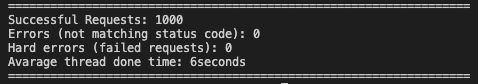

# gobuster

This is my implementation of gobuster

- Speed
- Flexibility
- Simplicity
- Clean code

## Speed

I have also made this tool in python, and with go-lang its quite faster!

It is able to proccess a 1000 line wordlist in around 6 seconds, on a dual-core mac. In this example, it is using 50 goroutine threads.
